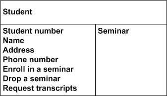
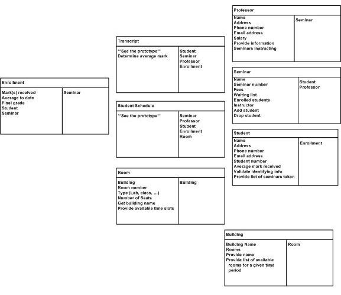

# Week 1 study notes

## Version Control
**Why do we use version control? How can we benefit from it? Give at least 7 features.**

- **Backup and Restore**: For instance, if there is an accident, we can restore our code from backups.
- **Synchronization**: Makes teamwork easier as multiple people can make changes simultaneously.
- **Short Term Undo**: Useful for reverting performance degradations after recent code changes.
- **Long Term Undo**: Allows reverting the code to a previous state if a severe bug is discovered later.
- **Track Changes**: Helps in identifying who made specific changes and facilitating discussions.
- **Sandboxing**: Changes can be made in a local environment without affecting the main repository until they are ready.
- **Branching and Merging**: Facilitates the management of different versions and collaborative improvements before merging into the main branch.

---

## Git Actions
**What do the four states in the "git status" report mean?**

- **Untracked**: The file is new and has not been added to git tracking yet.
- **Staged**: Changes have been marked to be included in the next commit.
- **Tracked**: Changes are committed.
- **Dirty/Modified**: Changes have been made but not yet staged.

### Git Status States
**If you worked on a file, did action A, then decided to make another change so that your first one doesn't end up in the git log, what is action A (choose between these actions: clone, add, commit, push, pull)? What is your rationale for this choice?**

Action A should be `git commit`. This is because committing records changes that are in the staged state. If the initial changes isn't added, they won't be included in the commit, hence not appearing in the git log.

### Undoing Changes
**If you introduced a new feature but later decided to undo it without making it visible to others, what steps should you take?**

- If the feature is untracked, simply remove the related code.
- If the feature is staged or tracked, clone a copy of the remote repository and reintegrate all changes except for the new feature.
- If the feature is pushed, use `git revert` to roll back to the version prior to the introduction of the feature, then commit and push these changes.

---

## Programming Languages
**What is the difference between an "interpreted" language and a "compiled" language?**

- **Compiled Language**: Requires a compilation step to translate source code into machine code, typically resulting in an executable file (.exe).
- **Interpreted Language**: Does not require compilation before running; instead, it is executed line by line by an interpreter during runtime.
- **Hybrid**: Here using Java as an example. Java will compile the program into bytecode first, then use the JVM to translate those **bytecode** and execute them during runtime.
  > **Bytecode**:
  > Java programs are compiled to an intermediate state called bytecode, which is the machine code for the Java Virtual Machine (JVM). This allows Java to run on multiple platforms, as JVM handles the conversion of bytecode into native machine code.


### Java Basics
**What does a Java class look like?**

```java
/**
 * Class declaration following PascalCase naming convention.
 */
public class PascalCase {

    /**
     * Constructor with the same name as the class name.
     */
    public PascalCase() {
        // Constructor body
    }

    /**
     * Method following camelCase naming convention.
     */
    private void camelCase() {
        // Method body
    }
}
```

**Terminologies**:
- **Constructor**: Called when an object is created; initializes the object.
- **Method**: Functions designed to perform specific tasks.
- **Access Modifier**: Specifies the visibility of a class attribute or method (e.g., `default`, `public`, `protected`, and `private`).
- **Inheritance**: Allows a class to inherit attributes and methods from another class. (**Note**: But we can only access those asing the public access modifier)
- **Getter/Setter**: Methods used to access or update the value of a private attributes. (This is because in Java we're prefer write attribute in private, to prevent accident)

**Method Signature**: Includes the access modifier, return type, method name, and parameters.

**Constructor vs Method**: Constructors have the same name as the class and do not have a return type.

## System Design and UML
**How do we decide which classes belong in our program? What is UML?**

Classes are determined based on system requirements. UML (Unified Modeling Language) is used to design and express system architecture through diagrams.

**Example for University Personnel Specification**:
- **Person**: 
  - Attributes include: list of name, utorID
  - Methods include: changeName, toString
- **Student**: 
  - Attributes include: studentID
  - Method includes: toString

**Example for Restaurant Specification Analysis**:
Important nouns are initially underlined to identify potential classes and attributes.

### Scenario Walkthrough and User Stories
- **Scenario Walkthrough**: Technique to validate design coherence by applying hypothetical scenarios.
- **User Story**: Describes a software feature from an end-user's perspective. Helps define necessary steps and features for use cases.
- **Use Case vs User Story**: Use cases are detailed interactions between users and the system based on user stories.
- **Use Case Interactor**: A component or actor involved in fulfilling a use case, e.g., `PriceCheckInteractor` for checking item prices online.

### Key Steps for Converter User Stories into Class
1. **Identify important nouns**
      + Underlined potential classes name
      + Underlined potential class attribute name
2. **Choose potential classes**
      + Choose from the nouns we underlineded
3. **Identify verbs that describe responsibilities**
      + Find the verbs that describe tasks that a class my be responsible for doing.
        + Method and method name

### Class Responsibility and Collaborators (CRC)

A CRC model is used to demonstrate how a class collaborates with others to fulfill a specific use case.

+ **In other words:**
The CRC model illustrates how a class will collaborate with others to complete a use case.

**Example Template:**
*(For more detail, please refer to Lecture 1 slides starting from page 40):*
<!--  -->
<p align="center">
  
  
</p>

**Usage Example**
<!--  -->
<p align="center">
  
</p>
