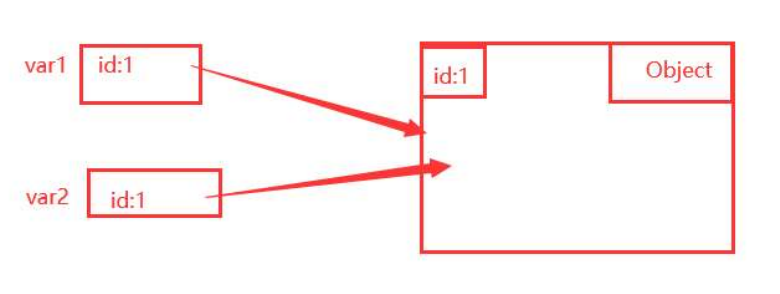

### Week 3 Study Notes

## Inheritance and Polymorphism

### Subclass and Superclass Relationships
**Why can we use a subclass object in place of a superclass object, but not vice versa?**

A `Student` is a subclass of `Person`, which means the `Student` class has all the methods and attributes that are in the `Person` class. This allows for upper casting without any errors. However, since `x` is a `Person` object, it does not contain any of the `Student` class methods or attributes. Thus, placing it into `Student` would result in errors.

**Example:**
```java
Person x = new Person();
Student y = new Student();

// This is allowed because Student is a subclass of Person
Person p = y;

// This is not allowed because Person is not a subclass of Student
Student s = x;  // Compilation error
```

### Method Overriding and Shadowing
**What do "override" and "shadow" mean?**

- **Override:** When a subclass method overrides the superclass method. This ensures that if you create a subclass (regardless of whether you use `Subclass s = new Subclass();` or `Superclass s = new Subclass();`), the method call will always resolve to the subclass method.

**Example:**
```java
class Person {
    void display() {
        System.out.println("Person");
    }
}

class Student extends Person {
    @Override
    void display() {
        System.out.println("Student");
    }
}

Person p = new Student();
p.display();  // Outputs "Student"
```

- **Shadow:** Used for static methods or variables, it hides the superclass method or variable. If the subclass has a static method `foo()` and the superclass also has a public static method `foo()`, Java uses the object type to determine which method to call.

**Example:**
```java
class Parent {
    static void display() {
        System.out.println("Parent");
    }
}

class Child extends Parent {
    static void display() {
        System.out.println("Child");
    }
}

Parent p = new Child();
p.display();  // Outputs "Parent" because static methods are resolved at compile time
```

### Compiler Behavior
**How does the compiler handle object and variable types?**

The compiler does not run the code, so it only checks if the variable type is legal. If you perform an illegal operation on the object, the compiler does not know until runtime, at which point Java will throw an error.

**Example:**
```java
Student s = new Student();
Integer a = (Integer) s;  
// Compiler will not catch this, but runtime will throw a ClassCastException
```

## Method Resolution and Equality

### Method Resolution
**Where does the compiler check for a method if it is not found in the declared class?**

When calling `z.foo()` on `Person z = new Student();`, the compiler checks:
1. The `Person` class.
2. If `Person` does not have `foo()`, it checks the subclass `Student`.
3. If no superclass contains the method, the compiler throws an error.

### Equality of References and Primitives
**What will `var1 == var2` evaluate to if they have reference types or primitive types?**

- **Reference Types:** Evaluates whether the two references point to the same memory location.
- **Primitive Types:** Evaluates the actual values held in memory.

**Example:**
```java
String a = new String("test");
String b = new String("test");

System.out.println(a == b);  // false, because they are different objects in memory
System.out.println(a.equals(b));  // true, because their values are the same

int x = 5;
int y = 5;
System.out.println(x == y);  // true, because their values are the same
```

## Memory Model and Documentation

### Memory Model
**How does the memory model diagram show two aliases for the same object?**

The diagram indicates that both `var1` and `var2` point to the same object in memory, demonstrating aliasing.

**Example:**


### Documentation
**Why use Javadoc instead of inline comments?**

- **Javadoc:** Used for API documentation, helping others understand what the method does and how to use or implement it.
- **Inline Comments:** Assist both the original developer and others in understanding the code.

**Example:**
```java
/**
 * Calculates the sum of two integers.
 *
 * @param a the first integer
 * @param b the second integer
 * @return the sum of a and b
 */
public int sum(int a, int b) {
    return a + b;
}
```

## Business Rules and Architecture

### Business Rules
**Difference between Enterprise Business Rules and Application Business Rules:**

- **Enterprise Business Rules:** Core rules like entities, forming the basic foundation.
- **Application Business Rules:** Use cases that utilize the Enterprise Business Rules.

### Clean Architecture Dependency Rules
**What are the Clean Architecture Dependency Rules?**

Following Clean Architecture Dependency (CAD) rules makes the project easier to maintain, test, change features, and enhances flexibility.

**Example:**
In Clean Architecture, the business logic should not depend on UI or database layers. Instead, they should all depend on abstractions (interfaces).

```java
public interface UserRepository {
    void save(User user);
    User findById(String userId);
}

public class UserService {
    private UserRepository userRepository;

    public UserService(UserRepository userRepository) {
        this.userRepository = userRepository;
    }

    // Business logic methods
}
```